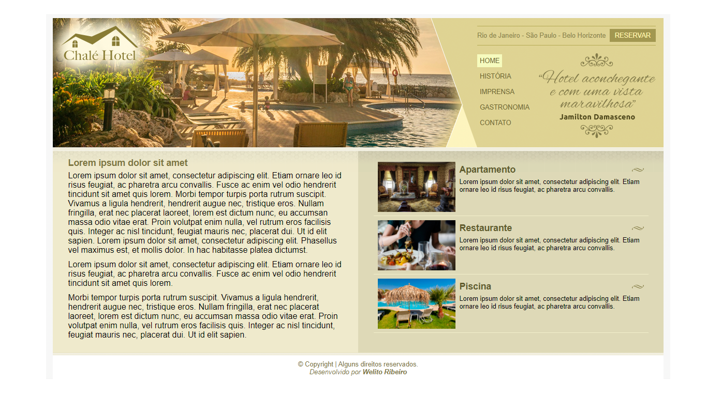

# Site Chalé Hotel
 Projeto de uma *home page* desenvolvida por mim durante aula do professor Jamilton Damasceno no curso de desenvolvimento web da Udemy.
 Foi criado usando **HTML5** e **CSS3**, utilizando o conceito de *layout* líquido.

